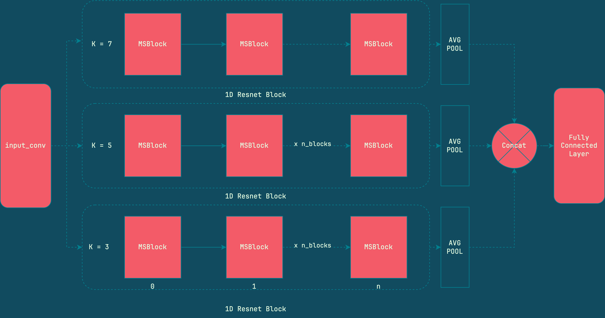

# multiscale_resnet1d
My re-write of the multi-scale-1d-resnet implemented originally [here](https://github.com/geekfeiw/Multi-Scale-1D-ResNet/).
No major changes in the architecture, just written it so that adding scales and number of residual blocks can be done when creating the module instance. Besides everything fits under `150` loc in a single file.
Changes and Contributions are appreciated.


## Usage
``` python
import torch

from multi_scale_resnet1d import MSResnet

x = torch.randn(8,32,256) # B,C,T

in_channels = 32
out_channels = 64
scale_list = (3,5,7) # multi sclase
n = 3 # number of conv1d blocks in each residual block
C = 2 # number of classes
model = MSResnet(in_channels,out_channels,C,n,scale_list)

out = model(x) # (B,C)
```

## Requirements
- PyTorch > 1.8.x
- Python > 3.8.x
---
`FrexG` 2023